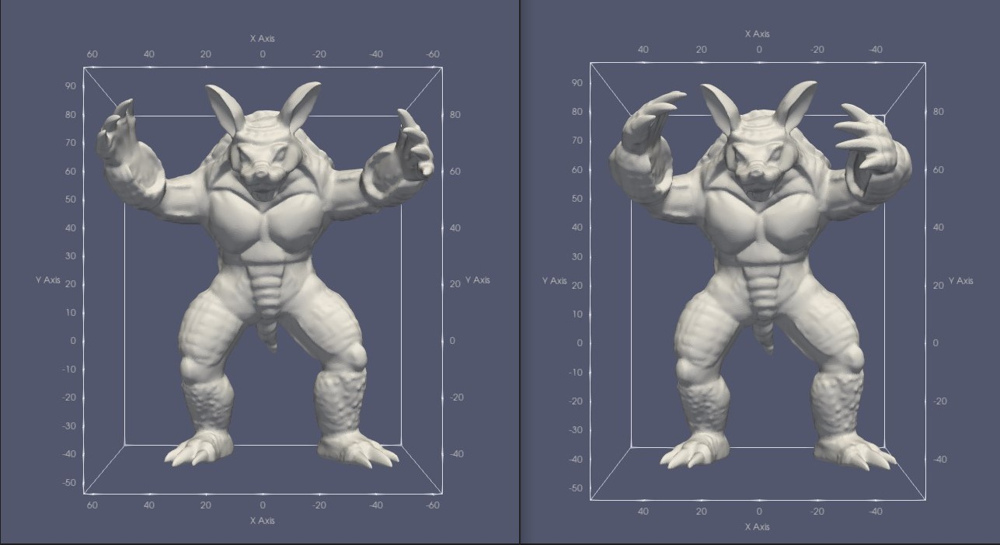

<h1 align = "center">Linear Hydrostatic Analysis</h1>

## Document Description

+ `include` contains all the header files.

  + `info.hpp` contains some macro definitions.
  
  + `LinSysSolver.hpp` defines an abstract base class that stores sparse matrices in CSR format for the assembly of stiffness matrices and the solution of linear systems.
  
    `EigenLibSolver.hpp` and `CHOLMODSolver.hpp` are the corresponding inherited classes, representing the use of the Eigen library or CHOLMOD library to solve.
    
  + `readTetMesh.hpp` defines the function to read the tetrahedral mesh.msh file.
  
    `readHexMesh.hpp` defines the function to read the hexahedral mesh .in files, where the .in files are parsed from the .vtk files.
  
    `readCondition.hpp` defines function to read boundary conditions and other information, with requirements for the input file format.
  
  + `shapeInterface.hpp` defines the abstract base class for the grid.
  
    `tet4nodeEle.hpp` is an inherited 4-node tetrahedron class.
  
    `hex8nodeEle.hpp` is an inherited 8-node hexahedron class.
  
  + `tet4nodeSolver.hpp` encapsulates the finite element analysis process of a tetrahedral mesh model.
  
    `hex8nodeSolver.hpp` encapsulates the finite element analysis process of a hexahedral mesh model.
  
+ `tests` contains all test examples.

  + `tet_cube` tests a simple mesh model with 8 vertices and 8 tetrahedra, and the correctness was verified by a matlab program.
  + `tet_bunny` tests the tetrahedral mesh model *bunny.msh*.
  + `tet_armadillo` tests the tetrahedral mesh model *Armadillo219K.msh*, which has 219k nodes and takes about 30 minutes to solve using the Eigen library and only 5 minutes using the CHOLMOD library.
  + `hex_smallCube` tests a small cube model consisting of 27 small hexahedra and verified the correctness using matlab.
  + `hex_cube` tests a larger cube model consisting of 512 hexahedra with a total of 729 nodes.

## Compile and Run

The code author has the following environment and software locally:

+ Ubuntu 20.04
+ g++(GCC) 11.2.0 (C++20)
+ Python 3.8.10
+ CMake 3.16.3
+ Eigen 3.3.7
+ SuiteSparse 5.7.1
+ [MshIO](https://github.com/qnzhou/MshIO)
+ [meshio 5.3.4](https://github.com/nschloe/meshio)

Compiling:

+ In the *hex* test samples, type the command

  ```bash
  mkdir build && cd build
  cmake ..
  make
  ```

  to compile. Type `./main` to run it.

+ In the *tet* samples, type `make` to compile. Type `./main` to run it.

## Theoretical Analysis

### Spatial 4-node Tetrahedral Unit

1. **node description**

   geometric coordinates: $(x_i, y_i, z_i)$

   node displacement vector: $[u_1, v_1, w_1, u_2,v_2,w_2, u_3,v_3,w_3,u_4,v_4,w_4]^T$

   node force vector: $[P_{x1}, P_{y1}, P_{z1}, P_{x2}, P_{y2}, P_{z2}, P_{x3}, P_{y3}, P_{z3}, P_{x4}, P_{y4}, P_{z4}]^T$

2. **displacement field description**
   $$
   \left.\begin{align*}
   u(x,y,z) &= a_0+a_1x+a_2y+a_3z \\
   v(x,y,z) &= b_0+b_1x+b_2y+b_3z \\
   w(x,y,z) &= c_0+c_1x+c_2y+c_3z
   \end{align*}\right\}
   $$

   $$
   \left\{\begin{align*}
   u(x,y,z) &= N_1(x,y,z)u_1+N_2u_2+N_3u_3+N_4u_4 \\
   v(x,y,z) &= N_1(x,y,z)v_1+N_2v_2+N_3v_3+N_4v_4 \\
   w(x,y,z) &= N_1(x,y,z)w_1+N_2w_2+N_3w_3+N_4w_4
   \end{align*}\right.
   $$

   $$
   \begin{align*}
   \textbf{u}(x,y,z) &= \begin{bmatrix} u(x,y,z) \\ v(x,y,z) \\ w(x,y,z) \end{bmatrix} = \textbf{N}(x,y,z)\cdot \textbf{q}^e \\
   &= \begin{bmatrix} 
   N_1 & 0 & 0 & N_2 & 0 & 0 & N_3 & 0 & 0 & N_4 & 0 & 0 \\
   0 & N_1 & 0 & 0 & N_2 & 0 & 0 & N_3 & 0 & 0 & N_4 & 0 \\
   0 & 0 & N_1 & 0 & 0 & N_2 & 0 & 0 & N_3 & 0 & 0 & N_4
   \end{bmatrix}\cdot \textbf{q}^e
   \end{align*}
   $$

3. **strain field**
   $$
   \begin{align*}
   \mathbf{\epsilon}(x,y,z) = \begin{bmatrix}\epsilon_{xx}\\\epsilon_{yy}\\\epsilon_{zz}\\\epsilon_{xy}\\\epsilon_{yz}\\\epsilon_{zx}\end{bmatrix}=\begin{bmatrix}
   \frac{\partial}{\partial x} & 0 & 0\\
   0 & \frac{\partial}{\partial y} & 0\\
   0 & 0 & \frac{\partial}{\partial z}\\
   \frac{\partial}{\partial y} & \frac{\partial}{\partial x} & 0\\
   0 & \frac{\partial}{\partial z} & \frac{\partial}{\partial y}\\
   \frac{\partial}{\partial z} & 0 & \frac{\partial}{\partial x}
   \end{bmatrix}\begin{bmatrix}u\\ v \\ w\end{bmatrix} = [\partial]\mathbf{N}\cdot\mathbf{q}^e = \mathbf{B}\cdot\mathbf{q}^e
   \end{align*}
   $$

4. **stress field**
   $$
   \mathbf{\sigma} = \mathbf{D}\cdot\mathbf{\epsilon} = \mathbf{D}\cdot\mathbf{B}\cdot\mathbf{q}^e=\mathbf{S}\cdot\mathbf{q}^e
   $$

5. **principle of minimum potential energy**
   $$
   \begin{align*}
   \Pi^e &= \frac{1}{2}\int_{\Omega^e}\mathbf{\sigma}^T\mathbf{\epsilon}\ d\Omega - \left[\int_{\Omega^e}\overline{\mathbf{b}}^T\mathbf{u}\ d\Omega+\int_{S^e_p}\overline{\mathbf{p}}^T\mathbf{u}\ dA\right] \\
   &= \frac{1}{2}\mathbf{q}^{eT}\left(\int_{\Omega^e}\mathbf{B}^T\mathbf{DB}\ d\Omega\right)\mathbf{q}^e - \left(\int_{\Omega^e}\mathbf{N}^T\overline{\mathbf{b}}\ d\Omega+\int_{S^e_q}\mathbf{N}^T\overline{\mathbf{p}}\ dA\right)^T\mathbf{q}^e \\
   &= \frac{1}{2}\mathbf{q}^{eT}\mathbf{K}^e\mathbf{q}^e - \mathbf{P}^{eT}\mathbf{q}^e
   \end{align*}
   $$

### Spatial 8-node Hexahedron Unit

The analysis process is similar to the above process.

